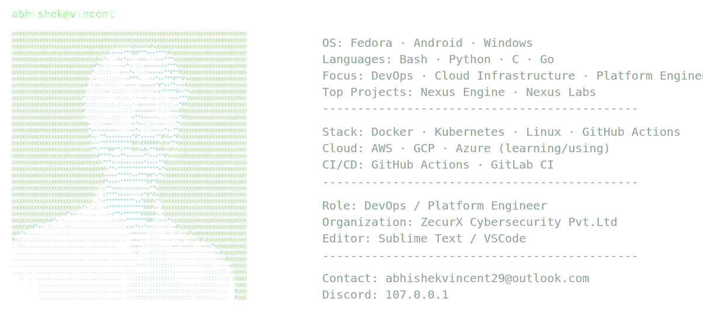

<picture>
  <source media="(prefers-color-scheme: dark)" srcset="assets/dark-ne.svg">
  <source media="(prefers-color-scheme: light)" srcset="assets/light-ne.svg">
  
</picture>

## Hi, I'm Abhishek

Platform & Infrastructure focused engineer building containerized lab environments, automation systems, and security tooling.

## Tech Stack

## Connect

  

  

  

  

